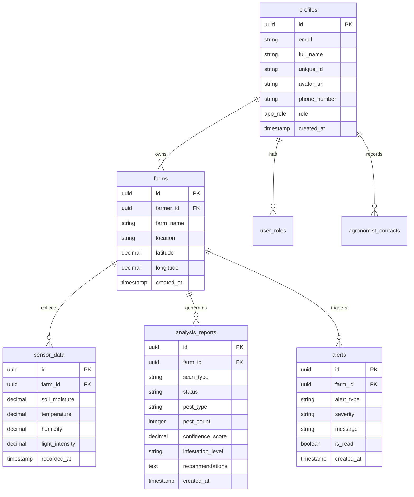

<p align="center">
  
</p>

<p align="center">
  <strong>AI-Powered Crop Health Monitoring & Farm Management Platform</strong>
</p>

<p align="center">
  <a href="#features">Features</a> •
  <a href="#tech-stack">Tech Stack</a> •
  <a href="#architecture">Architecture</a> •
  <a href="#getting-started">Getting Started</a> •
  <a href="#project-structure">Structure</a> •
  <a href="#api-reference">API</a>
</p>

<p align="center">
  
  
  
  
  
</p>

<p align="center">
  
  
  
</p>

---

## 📋 Table of Contents

- [✨ Features](#-features)
- [🛠 Tech Stack](#-tech-stack)
- [🏗 Architecture](#-architecture)
- [📁 Project Structure](#-project-structure)
- [🚀 Getting Started](#-getting-started)
- [🔐 Environment Variables](#-environment-variables)
- [🗄 Database Schema](#-database-schema)
- [📡 API Reference](#-api-reference)
- [🔒 Security](#-security)
- [📱 Responsive Design](#-responsive-design)
- [🤝 Contributing](#-contributing)

---

## ✨ Features

<table>
<tr>
<td width="50%">

### 🔬 AI-Powered Analysis
- **Pest Detection** - Real-time image/video analysis
- **Disease Identification** - Crop health diagnostics
- **Smart Recommendations** - AI-driven farm advice
- **Voice Interaction** - Speech-to-text queries

</td>
<td width="50%">

### 📊 Real-Time Monitoring
- **Sensor Integration** - IoT data ingestion
- **Weather Tracking** - 7-day forecasts & alerts
- **Market Prices** - Live commodity tracking
- **Alert System** - SMS & push notifications

</td>
</tr>
<tr>
<td width="50%">

### 👥 User Management
- **Role-Based Access** - Farmer & Agronomist roles
- **Profile Management** - Avatar, contact info
- **Session Security** - 1-hour inactivity timeout
- **Expert Directory** - Connect with agronomists

</td>
<td width="50%">

### 📈 Analytics & Reports
- **Analysis History** - Searchable scan records
- **Trend Visualization** - Charts & graphs
- **Export Capabilities** - Download reports
- **Farm Advisor** - Personalized insights

</td>
</tr>
</table>

---

## 🛠 Tech Stack

### Frontend

| Technology | Version | Purpose |
|:-----------|:--------|:--------|
|  | 18.3.1 | UI Framework |
|  | 5.6+ | Type Safety |
|  | 6.0 | Build Tool |
|  | 3.4 | Styling |
|  | Latest | Component Library |
|  | 5.x | Data Fetching |
|  | 6.x | Navigation |

### Backend (Lovable Cloud)

| Technology | Purpose |
|:-----------|:--------|
|  | Database |
|  | Serverless Logic |
|  | Authentication |
|  | File Storage |

### External Integrations

| Service | Purpose |
|:--------|:--------|
|  | Speech-to-Text |
|  | SMS & Voice Alerts |
|  | AI Chat Assistant |
|  | Weather Data |

---

## 🏗 Architecture

```
┌─────────────────────────────────────────────────────────────────┐
│                        CLIENT (React SPA)                        │
├─────────────────────────────────────────────────────────────────┤
│  ┌──────────┐  ┌──────────┐  ┌──────────┐  ┌──────────────────┐ │
│  │  Pages   │  │Components│  │  Hooks   │  │    Contexts      │ │
│  │          │  │          │  │          │  │                  │ │
│  │ • Auth   │  │ • Layout │  │ • Toast  │  │ • AuthContext    │ │
│  │ • Farmer │  │ • UI     │  │ • Mobile │  │ • SessionMgmt    │ │
│  │ • Admin  │  │ • Charts │  │ • Query  │  │                  │ │
│  └──────────┘  └──────────┘  └──────────┘  └──────────────────┘ │
└───────────────────────────┬─────────────────────────────────────┘
                            │ HTTPS
                            ▼
┌─────────────────────────────────────────────────────────────────┐
│                    LOVABLE CLOUD (Backend)                       │
├─────────────────────────────────────────────────────────────────┤
│  ┌─────────────────────────────────────────────────────────────┐│
│  │                    Edge Functions (Deno)                     ││
│  │  ┌──────────────┐ ┌──────────────┐ ┌──────────────────────┐ ││
│  │  │ detect-pest  │ │chat-assistant│ │ speech-to-text       │ ││
│  │  │              │ │              │ │                      │ ││
│  │  │ AI Analysis  │ │ Gemini API   │ │ OpenAI Whisper       │ ││
│  │  └──────────────┘ └──────────────┘ └──────────────────────┘ ││
│  │  ┌──────────────┐ ┌──────────────┐                          ││
│  │  │send-twilio-  │ │receive-sensor│                          ││
│  │  │alert         │ │-data         │                          ││
│  │  │              │ │              │                          ││
│  │  │ SMS & Voice  │ │ IoT Ingestion│                          ││
│  │  └──────────────┘ └──────────────┘                          ││
│  └─────────────────────────────────────────────────────────────┘│
│  ┌────────────────┐ ┌────────────────┐ ┌──────────────────────┐ │
│  │   PostgreSQL   │ │    Storage     │ │   Authentication     │ │
│  │                │ │                │ │                      │ │
│  │ • profiles     │ │ • crop-scans   │ │ • Email/Password     │ │
│  │ • farms        │ │ • avatars      │ │ • Session Management │ │
│  │ • sensor_data  │ │ • chat-attach  │ │ • Role-Based Access  │ │
│  │ • alerts       │ │ • analysis     │ │                      │ │
│  │ • reports      │ │                │ │                      │ │
│  └────────────────┘ └────────────────┘ └──────────────────────┘ │
└─────────────────────────────────────────────────────────────────┘
```

---

## 📁 Project Structure

```
cropguard/
├── 📂 public/                    # Static assets
│   ├── favicon.ico
│   ├── placeholder.svg
│   └── robots.txt
│
├── 📂 src/
│   ├── 📂 assets/                # Images & media
│   │   ├── experts/              # Expert profile images
│   │   └── hero-farm-background.jpg
│   │
│   ├── 📂 components/            # Reusable components
│   │   ├── 📂 ui/                # shadcn/ui components (60+ components)
│   │   ├── AIChatWidget.tsx      # Floating AI assistant
│   │   ├── Layout.tsx            # Main app layout
│   │   ├── NavLink.tsx           # Navigation links
│   │   ├── ProtectedRoute.tsx    # Auth guard
│   │   └── WeatherCard.tsx       # Weather display
│   │
│   ├── 📂 contexts/
│   │   └── AuthContext.tsx       # Authentication state
│   │
│   ├── 📂 hooks/                 # Custom React hooks
│   │   ├── use-mobile.tsx        # Responsive detection
│   │   ├── use-toast.ts          # Toast notifications
│   │   └── useFarmAdvisorStatus.ts
│   │
│   ├── 📂 integrations/
│   │   └── 📂 supabase/          # Auto-generated
│   │       ├── client.ts         # Supabase client
│   │       └── types.ts          # Database types
│   │
│   ├── 📂 pages/
│   │   ├── 📂 admin/             # Admin panel pages
│   │   │   ├── AdminDashboard.tsx
│   │   │   ├── AnalysisReview.tsx
│   │   │   ├── FarmManagement.tsx
│   │   │   └── UserManagement.tsx
│   │   │
│   │   ├── 📂 farmer/            # Farmer portal pages
│   │   │   ├── Dashboard.tsx     # Main dashboard
│   │   │   ├── Alerts.tsx        # Notifications
│   │   │   ├── Analysis.tsx      # Report history
│   │   │   ├── ExpertDirectory.tsx
│   │   │   ├── FarmAdvisor.tsx   # AI recommendations
│   │   │   ├── FarmStore.tsx     # Marketplace
│   │   │   ├── MarketTrends.tsx  # Price tracking
│   │   │   ├── Profile.tsx       # User profile
│   │   │   ├── ReportDetails.tsx # Single report view
│   │   │   ├── Sensors.tsx       # IoT monitoring
│   │   │   ├── Upload.tsx        # Image/video upload
│   │   │   └── Weather.tsx       # Forecasts
│   │   │
│   │   ├── Auth.tsx              # Login/Signup
│   │   ├── Index.tsx             # Route handler
│   │   ├── Landing.tsx           # Public homepage
│   │   ├── NotFound.tsx          # 404 page
│   │   ├── PrivacyPolicy.tsx
│   │   └── TermsOfService.tsx
│   │
│   ├── 📂 utils/                 # Helper functions
│   │   ├── farmAdvisor.ts        # Recommendation logic
│   │   ├── sensorAlerts.ts       # Alert thresholds
│   │   ├── weather.ts            # Weather API
│   │   └── weatherAlerts.ts      # Weather warnings
│   │
│   ├── App.tsx                   # Root component
│   ├── App.css                   # Global styles
│   ├── index.css                 # Tailwind imports
│   └── main.tsx                  # Entry point
│
├── 📂 supabase/
│   ├── 📂 functions/             # Edge functions
│   │   ├── chat-assistant/       # AI chat
│   │   ├── detect-pest/          # Image analysis
│   │   ├── receive-sensor-data/  # IoT endpoint
│   │   ├── send-twilio-alert/    # SMS notifications
│   │   └── speech-to-text/       # Voice transcription
│   │
│   └── config.toml               # Supabase config
│
├── .env                          # Environment variables
├── index.html                    # HTML template
├── tailwind.config.ts            # Tailwind configuration
├── vite.config.ts                # Vite configuration
└── tsconfig.json                 # TypeScript config
```

---

## 🚀 Getting Started

### Prerequisites

- **Node.js** >= 18.0.0
- **npm** >= 9.0.0 or **Bun**
- **Git**

### Installation

```bash
# 1. Clone the repository
git clone <YOUR_GIT_URL>

# 2. Navigate to project directory
cd cropguard

# 3. Install dependencies
npm install
# or
bun install

# 4. Start development server
npm run dev
# or
bun dev
```

### Available Scripts

| Command | Description |
|:--------|:------------|
| `npm run dev` | Start development server |
| `npm run build` | Build for production |
| `npm run preview` | Preview production build |
| `npm run lint` | Run ESLint |

---

## 🔐 Environment Variables

> ⚠️ The `.env` file is auto-generated by Lovable Cloud. Do not edit manually.

| Variable | Description |
|:---------|:------------|
| `VITE_SUPABASE_URL` | Backend API endpoint |
| `VITE_SUPABASE_PUBLISHABLE_KEY` | Public API key |
| `VITE_SUPABASE_PROJECT_ID` | Project identifier |

### Edge Function Secrets

| Secret | Service |
|:-------|:--------|
| `OPENAI_API_KEY` | Speech-to-text (Whisper) |
| `TWILIO_ACCOUNT_SID` | SMS/Voice alerts |
| `TWILIO_AUTH_TOKEN` | Twilio authentication |
| `TWILIO_PHONE_NUMBER` | Sender phone number |
| `LOVABLE_API_KEY` | AI Gateway access |

---

## 🗄 Database Schema



---

## 📡 API Reference

### Edge Functions

<details>
<summary><code>POST</code> <code>/functions/v1/detect-pest</code> - Analyze crop images</summary>

**Request Body:**
```json
{
  "imageUrl": "storage://crop-scans/image.jpg",
  "scanType": "spot_check" | "drone_flight"
}
```

**Response:**
```json
{
  "success": true,
  "detections": [...],
  "pest_type": "Aphids",
  "pest_count": 5,
  "confidence": 0.92,
  "recommendations": "...",
  "report_id": "uuid"
}
```
</details>

<details>
<summary><code>POST</code> <code>/functions/v1/chat-assistant</code> - AI chat</summary>

**Request Body:**
```json
{
  "messages": [
    { "role": "user", "content": "How do I treat aphids?" }
  ]
}
```

**Response:** Server-Sent Events stream
</details>

<details>
<summary><code>POST</code> <code>/functions/v1/speech-to-text</code> - Voice transcription</summary>

**Request Body:**
```json
{
  "audio": "base64-encoded-audio"
}
```

**Response:**
```json
{
  "text": "Transcribed speech content"
}
```
</details>

<details>
<summary><code>POST</code> <code>/functions/v1/send-twilio-alert</code> - SMS/Voice alerts</summary>

**Request Body:**
```json
{
  "to": "+1234567890",
  "message": "Alert message",
  "alertType": "sms" | "call",
  "pestType": "Aphids",
  "infestationLevel": "high"
}
```
</details>

<details>
<summary><code>POST</code> <code>/functions/v1/receive-sensor-data</code> - IoT ingestion</summary>

**Request Body:**
```json
{
  "farm_id": "uuid",
  "soil_moisture": 45.5,
  "temperature": 28.3,
  "humidity": 65.0,
  "light_intensity": 850
}
```
</details>

---

## 🔒 Security

### Authentication Flow

```
┌────────────┐     ┌──────────────┐     ┌────────────────┐
│   Client   │────▶│  Supabase    │────▶│   PostgreSQL   │
│            │     │  Auth        │     │   + RLS        │
└────────────┘     └──────────────┘     └────────────────┘
                          │
                          ▼
                   ┌──────────────┐
                   │  JWT Token   │
                   │  (1hr TTL)   │
                   └──────────────┘
```

### Security Features

| Feature | Implementation |
|:--------|:---------------|
| **Row Level Security** | All tables protected with RLS policies |
| **Session Timeout** | 1-hour inactivity auto-logout |
| **Role-Based Access** | Farmer vs Agronomist permissions |
| **Secure Storage** | Private buckets for sensitive files |
| **API Authentication** | JWT tokens for all requests |

---

## 📱 Responsive Design

| Breakpoint | Width | Target |
|:-----------|:------|:-------|
| `sm` | 640px | Mobile landscape |
| `md` | 768px | Tablets |
| `lg` | 1024px | Laptops |
| `xl` | 1280px | Desktops |
| `2xl` | 1536px | Large screens |

---

## 🤝 Contributing

1. **Fork** the repository
2. **Create** a feature branch (`git checkout -b feature/amazing-feature`)
3. **Commit** changes (`git commit -m 'Add amazing feature'`)
4. **Push** to branch (`git push origin feature/amazing-feature`)
5. **Open** a Pull Request

---

## 📄 License

This project is licensed under the **MIT License**.

---

<p align="center">
  <sub>Built with ❤️ using <a href="https://lovable.dev">Lovable</a></sub>
</p>

<p align="center">
  <a href="https://lovable.dev/projects/d9e96150-4dfb-454c-b575-a58e9a5dcc27">
    
  </a>
</p>
